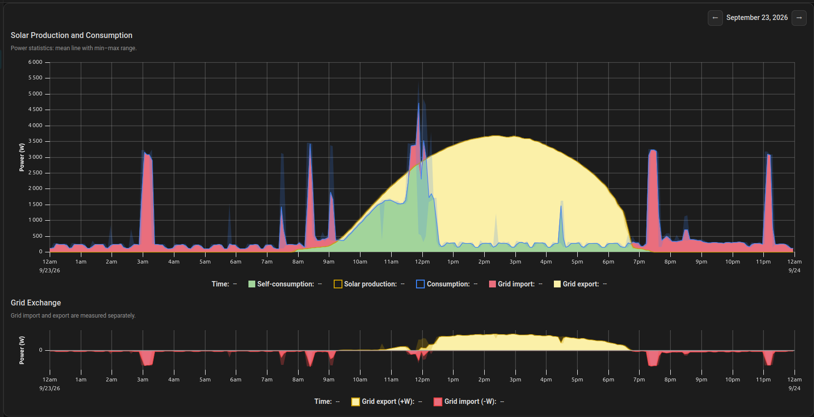
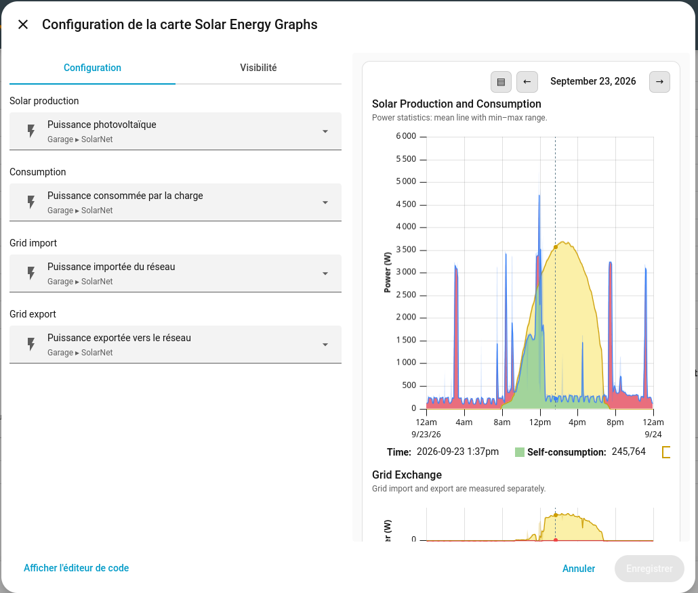

# Solar Energy Graphs Card

A Home Assistant Lovelace card for exploring daily solar production,
consumption, and grid exchange in two synchronized graphs.


<details>
<summary>Dark theme</summary>



</details>

## Features

- Compare solar production and consumption, with an estimate of direct
  self-consumption.
- View grid export above zero and grid import below zero in a separate graph.
- Synchronize the cursor and horizontal zoom across both graphs.
- Navigate between days using the arrows in the top-right corner. The selected
  day follows the Home Assistant time zone; direct date selection is not
  available.
- View recent and live updates for the current day.
- Follow the active Home Assistant theme.

## Requirements

Configure four separate Home Assistant power sensors:

| Setting | Sensor |
| --- | --- |
| Solar production | Power produced by the solar panels |
| Consumption | Power consumed by the load you want to compare with solar production |
| Grid import | Power imported from the grid |
| Grid export | Power exported to the grid |

Each sensor must have `device_class: power`, `state_class: measurement`, and a
unit of `W` or `kW`. The card does not infer sensor roles or derive grid import
from export, or vice versa. Check that each sensor's meaning and direction
match the role you assign to it.

Home Assistant must have history and statistics available for the selected
sensors. The card uses five-minute statistics when available and hourly
statistics for older periods. For the current day, recent recorded states and
live updates extend the graphs.

## Installation

Install the card from HACS, then add **Solar Energy Graphs Card** to a Lovelace
dashboard using the visual card picker.

The visual editor lets you select the four required power sensors:



If you configure the dashboard manually, use:

```yaml
type: custom:solar-energy-graphs-card
entities:
  production: sensor.your_solar_production
  consumption: sensor.your_consumption
  grid_import: sensor.your_grid_import
  grid_export: sensor.your_grid_export
```

Replace the example entity IDs with the matching sensors from your Home
Assistant installation.

## Using the graphs

The upper graph compares solar production with consumption. Direct
self-consumption is estimated as the lower of the two values; this estimate
assumes there is no battery and is not a direct measurement of energy flows.
The lower graph shows export above zero and import below zero.

Drag across a range to zoom in horizontally. Once zoomed in, drag to pan. The
cursor and horizontal zoom stay synchronized between the graphs.

Use the day arrows in the top-right corner to move to the previous or next day.
The next-day arrow is unavailable for today.

## Troubleshooting

- **“Custom element doesn't exist”**: confirm the card is installed and the
  dashboard has loaded its JavaScript resource; then refresh the browser.
- **No history is shown**: check the selected entities, their units and sensor
  classes, and whether Home Assistant has recorded history for the selected
  day.
- **Values look incorrect**: verify that each sensor is assigned to the right
  role and reports power in `W` or `kW`. The self-consumption estimate does
  not account for a battery.
