# Killing a surviving mutant -- a worked example

This guide follows one real case from start to finish: a mutant that survived
in `src/solar-energy-graphs-card.ts`, why it survived, the test that killed it
and how the fix was verified. It is meant for a developer who has never done
mutation testing. Read [the Stryker plan](PLAN_tests_de_mutation_avec_Stryker.md)
(French) for how the tool was set up in this project.

- [Mutation testing in five minutes](#mutation-testing-in-five-minutes)
- [The workflow at a glance](#the-workflow-at-a-glance)
- [Step 1 -- Run the mutation tests](#step-1----run-the-mutation-tests)
- [Step 2 -- Pick one survivor](#step-2----pick-one-survivor)
- [Step 3 -- Understand why it survived](#step-3----understand-why-it-survived)
- [Step 4 -- Write the test](#step-4----write-the-test)
- [Step 5 -- Prove that the test kills the mutant](#step-5----prove-that-the-test-kills-the-mutant)
- [Step 6 -- Commit](#step-6----commit)
- [Pitfalls met along the way](#pitfalls-met-along-the-way)

## Mutation testing in five minutes

Code coverage tells you which lines the tests **execute**. It does not tell
you whether any test **checks** what those lines do: a line can be run by
28 tests and still be verified by none of them.

Mutation testing answers that second question. Stryker makes one small
deliberate change to the source -- a **mutant** -- for example `||` becomes
`&&`, `>` becomes `>=`, a method call is removed, a string becomes `""`. It
then runs the tests against that broken version, and repeats for every mutant.

| Status | Meaning | Good? |
| --- | --- | --- |
| **Killed** | At least one test failed: the tests noticed the change. | Yes |
| **Timeout** | The mutant made the code loop; counted as killed. | Yes |
| **Survived** | Every test still passed: nothing checks this behavior. | No |
| **NoCoverage** | No test even executes this code. | No |

The **mutation score** is the share of killed (and timed-out) mutants. Each
survivor asks one question: *if someone introduced this exact bug, would the
tests catch it?*

A survivor is not always a missing test. When a mutant changes nothing
observable, it is **equivalent**: the original code was useless, and the right
fix is to simplify it rather than to write a test.

## The workflow at a glance



## Step 1 -- Run the mutation tests

Like every tool in this project, Stryker runs in the Podman dev container (see
[Development environment](architecture.md#development-environment)):

```sh
./dev.sh mutation
```

The full run takes about a minute and a half and writes the report to
`reports/mutation/mutation.html`. On 2026-10-01 it gave:

| File | Score | Killed | Timeout | Survived | No coverage |
| --- | --- | --- | --- | --- | --- |
| `energy-charts-renderer.ts` | 67.66 % | 362 | 0 | 153 | 20 |
| `home-assistant-energy-history.ts` | 83.76 % | 390 | 2 | 66 | 10 |
| `solar-energy-graphs-card.ts` | 60.14 % | 342 | 2 | 183 | 45 |

## Step 2 -- Pick one survivor

Open `reports/mutation/mutation.html` in a browser, click a file, and filter
on **Survived**. Each survivor is shown as a diff, with the mutator name and
the tests that executed the line.

Work on **one** survivor at a time. Prefer one that is:

- **isolated** -- a small function, so the cause is easy to find;
- **meaningful** -- a behavior a user would notice if it broke.

The survivor chosen here is mutant 1568, at
`src/solar-energy-graphs-card.ts:909`:

```diff
  function normalizeEntityId(entityId: string | null): string | null {
-   return entityId === null ? null : entityId.trim();
+   return entityId === null ? null : entityId;
  }
```

- **Mutator:** `MethodExpression` -- it removes a method call, here `.trim()`.
- **Covered by:** 28 tests. All of them still passed without `.trim()`.

It matters for users: in the Lovelace YAML, `production: " sensor.solar "`
should work. Without `.trim()`, the card looks up an entity named
`" sensor.solar "`, does not find it, and shows a sensor configuration error
instead of the graphs.

## Step 3 -- Understand why it survived

Ask: *which test should fail if this code were removed?* Then look for the
input that would make the code useful.

`.trim()` only does something when the entity ID has spaces around it. Every
entity ID in `src/solar-energy-graphs-card.test.ts` is clean:

```ts
const CARD_CONFIG = {
  type: "custom:solar-energy-graphs-card",
  entities: {
    production: "sensor.solar",
    consumption: "sensor.consumption",
    grid_import: "sensor.grid_import",
    grid_export: "sensor.grid_export",
  },
};
```

With or without `.trim()`, these IDs give the same result. The line is
**covered** -- 28 tests run it -- but no test provides the input that makes it
matter. This is the most common reason for a survivor.

Is the mutant equivalent? No: with spaces in the configuration, removing
`.trim()` breaks the card. So the fix is a test, not a code change.

## Step 4 -- Write the test

The test goes in `src/solar-energy-graphs-card.test.ts`, next to the one that
checks `null` entities, which already has the same shape:

```ts
// Trims spaces around configured entity IDs before querying Home Assistant.
it("trims configured entity IDs", async () => {
  card = new SolarEnergyGraphsCard();
  const hass = createHassContext();
  card.setConfig({
    ...CARD_CONFIG,
    entities: { ...CARD_CONFIG.entities, production: "  sensor.solar  " },
  });
  document.body.append(card);
  card.hass = hass;
  await vi.waitFor(() => expect(rendererInstances).toHaveLength(1));

  const requests = hass.callWS.mock.calls.map(([request]) => request);
  expect(requests.map((request) =>
    "statistic_ids" in request ? request.statistic_ids : request.entity_ids,
  )).toEqual([SENSOR_IDS, SENSOR_IDS, SENSOR_IDS]);
});
```

Design choices:

- **Test the behavior, not the implementation.** `normalizeEntityId` is not
  exported and the test does not call it. It goes through the real entry point,
  `setConfig`, and checks what the outside world sees: the entity IDs sent to
  Home Assistant (`hass.callWS` is a mock).
- **One dirty input.** Only `production` has spaces, so a failure points at
  one cause.
- **Assert the result, not just "no crash".** `toEqual(...)` checks the exact
  IDs in the two statistics requests and the history request. A test that only
  checks that the card renders would be weaker.

## Step 5 -- Prove that the test kills the mutant

A test that has never failed proves nothing. Check three things, in this
order.

**1. It passes on the real code.**

```sh
./dev.sh test
```

Result: 114 tests passed, one more than before.

**2. It fails with the mutant applied by hand.** Apply the mutation in a copy
of the project inside the container, so the working tree is never touched, and
run only the new test (`-t` filters tests by name):

```sh
podman run --rm \
  --volume "$PWD:/source:ro" \
  --volume solar-energy-graphs-card-node-modules:/workspace/solar-energy-graphs-card/node_modules \
  --workdir /workspace/solar-energy-graphs-card \
  localhost/solar-energy-graphs-card-dev:24.15.0 sh -ec '
    cp -R /source/. .
    sed -i "s/return entityId === null ? null : entityId.trim();/return entityId === null ? null : entityId;/" \
      src/solar-energy-graphs-card.ts
    npx vitest run src/solar-energy-graphs-card.test.ts -t "trims"
  '
```

Result:

```
× trims configured entity IDs
AssertionError: expected [] to have a length of 1 but got +0
```

The card never created its charts: `"  sensor.solar  "` is not in
`hass.states`, so the unit check failed and the card showed an error. The test
fails for the right reason.

**3. Stryker confirms it.** Rerun Stryker on that single line instead of the
whole project. It takes seconds instead of a minute and a half, which makes it
the right loop when fixing survivors one by one. `dev.sh` does not pass extra
arguments, so call the container directly:

```sh
podman run --rm \
  --volume "$PWD:/source:ro" \
  --volume solar-energy-graphs-card-node-modules:/workspace/solar-energy-graphs-card/node_modules \
  --workdir /workspace/solar-energy-graphs-card \
  localhost/solar-energy-graphs-card-dev:24.15.0 sh -ec '
    cp -R /source/. .
    npx stryker run --mutate "src/solar-energy-graphs-card.ts:909-909" --reporters clear-text
  '
```

Result:

```
Instrumented 1 source file(s) with 4 mutant(s)
 solar-energy-graphs-card.ts | 100.00 | 100.00 | 4 | 0 | 0 | 0 | 0 |
```

Stryker generates four mutants on line 909, and the new test kills all of
them, including the removed `.trim()`.

## Step 6 -- Commit

Commit the test alone, with a message that says which mutant it kills and why
it survived:

```
test(card): kill trim mutant in entity ID normalization

No test configured an entity ID with surrounding spaces, so removing
`.trim()` from normalizeEntityId survived mutation testing.
```

Then go back to Step 2 with the next survivor.

## Pitfalls met along the way

- **A whole file reported as NoCoverage.** Before the fix in `vite.config.ts`,
  all 572 mutants of `solar-energy-graphs-card.ts` were NoCoverage although the
  file was well tested. Stryker copies the project into
  `.stryker-tmp/sandbox-*/` and symlinks `node_modules` outside that copy. Vite
  then refused to serve `uplot/dist/uPlot.min.css?inline` (`Denied ID`), so the
  card's test suite failed to load and ran zero tests -- without stopping
  Stryker. `server.fs.allow` now includes the real `node_modules` path. If a
  file you know is tested shows only NoCoverage, suspect the setup before the
  tests.
- **`--mutate file.ts:909` mutates nothing.** A line range needs both ends:
  `file.ts:909-909`. With a single number, Stryker instruments zero mutants and
  stops with a misleading `No tests were executed`.
- **Survivors can hide behind other survivors.** On the same line, mutant
  `entityId === null` → `true` also survived before this test. One well-chosen
  input often kills several mutants at once, so rerun Stryker on the line
  rather than assuming which mutants are left.
